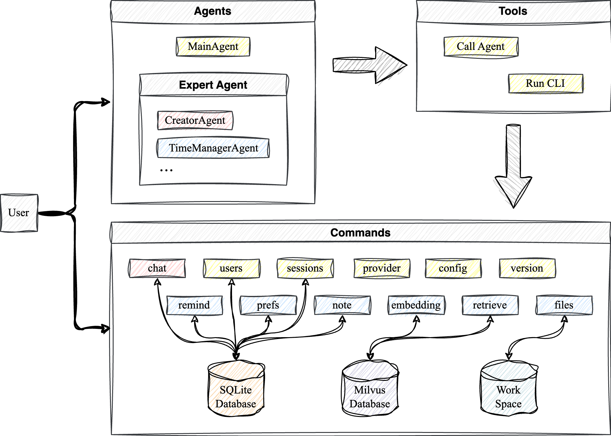

<p align="center">
    
</p>

## Introduction

**BEAVER** is a personal knowledge base assistant with a multi-agent backend and a browser UI. It combines
ReAct tool calling, RAG retrieval over your own documents, and long-lived user preferences.

<p align="center">
  
</p>

### Capabilities

- **Multi-agent** — a main agent handles the conversation and delegates to expert agents
  (time management, meeting minutes) or creates new ones on request.
- **ReAct tool calling** — the agent acts through native tools: notes, reminders, preferences,
  sessions, and the knowledge base. Write and delete operations ask you first, and your rejection
  reason is fed back to the model.
- **Knowledge base (RAG)** — upload documents in the browser and ask questions answered from their
  content. Supported: `.md` `.txt` `.pdf` `.docx` `.xlsx` `.xls` `.csv` `.pptx` (legacy binary
  `.doc` must be re-saved as `.docx`). Retrieval is scoped per user.
- **Preferences & memory** — user preferences are stored, consolidated automatically, and injected
  into every future conversation; each session ends with a generated summary that seeds the next one.
- **Streaming UI** — token-by-token output over WebSocket, with every tool call rendered as a card.

### Persistent Storage

- **SQLite** — users, conversations, messages, notes, reminders, preferences.
  > Initialization script: `scripts/init_db.py`
- **Chroma** — vector embeddings for semantic retrieval.
  > Initialization script: `scripts/init_chroma.py`

### Agent Support

**Tools**

- Agents call tools directly through native function calling (`note_add`, `remind_list`,
  `document_search`, …), authorized per agent so an expert only gets what it needs.
- `call_agent` switches to an expert agent; `create_expert_agent` lets the CreatorAgent build a new one.

**Built-in agents**

- **MainAgent**: talks to the user and picks the right tools
- **CreatorAgent**: creates and registers new expert agents
- **TimeManagerAgent** / **MeetingMinutesAgent**: example experts

### Architecture

```
Browser (uni-app H5)
   │  WebSocket /ws/chat/{session_id}  +  REST /api/*
   ▼
beaver_web/  FastAPI + WebAgentRuntime (ReAct loop, confirmations)
   ▼
beaver_agent/  Agent definitions + native tool registry
   ▼
beaver_client/  BeaverCoreClient facade (shared config, providers)
   ▼
beaver_core/ services → beaver_storage/ (SQLite) + Chroma (vectors)
   ▼
beaver_models/  LLM & embedding providers (OpenAI-compatible)
```

## Quick Start

### Prerequisites

- Python 3.11+
- Node.js 18+ (for the frontend)

### Installation

```bash
git clone https://github.com/ghbGC/Beaver.git
cd Beaver

uv sync --all-extras --no-extra mineru
source .venv/bin/activate   # Linux/macOS
# or
.venv\Scripts\activate      # Windows
```

### Initialize

```bash
python scripts/init_db.py       # SQLite
python scripts/init_chroma.py   # Chroma vector store (recreates the directory)
```

### Configure

Copy the sample and edit it, or just start the app and use the settings page in the browser:

```bash
cp config.yaml.example ~/.beaver/config.yaml
```

The config file lives at `~/.beaver/config.yaml`:

```yaml
user:
  username: <username>
model_provider:
  provider: openai            # any OpenAI-compatible endpoint
  model: deepseek-chat
  api_key: sk-xxxx
  base_url: https://api.deepseek.com/v1
embedding:
  provider: local             # openai | local | mock_embedding_provider
  model: BAAI/bge-m3
  model_path: D:/hf_cache/hub # local HuggingFace cache dir, provider: local only
```

`embedding.provider: openai` works with any OpenAI-compatible embedding API (Zhipu, DeepSeek, …).
`local` runs a sentence-transformers model from your HuggingFace cache and needs no API key
(`pip install 'beaver[local]'`). `mock_embedding_provider` is for tests only and cannot index documents.

### Run

```bash
# Backend (http://127.0.0.1:8000)
PYTHONPATH=src python -m uvicorn beaver_web.app:app --port 8000

# or, after `uv pip install -e .`:
beaver-web

# Frontend, development (http://localhost:5173, proxies /api and /ws to the backend)
cd src/beaver_web/frontend
npm install
npm run dev:h5
```

> **Don't run the backend with `--reload` while chatting.** The CreatorAgent writes new expert
> agents into `src/beaver_agent/`; a reloader watching the source tree would restart the server in the
> middle of the conversation and drop the session. `beaver-web` keeps reload off unless you set
> `BEAVER_RELOAD=1`, and even then it excludes the agent directory.

Production (single process — FastAPI serves the built H5 bundle):

```bash
cd src/beaver_web/frontend
npm run build:h5
# then start the backend and open http://127.0.0.1:8000
```

Enter any username to sign in: the account is created on first use and a new session starts.

## Using It

| Action | How |
|--------|-----|
| Chat | Type a message; Enter sends, Shift+Enter adds a newline |
| Add a document | 📎 上传文档 in the input bar, then ask about it, or ask the agent to index it |
| Approve a write | The agent asks before creating/updating/deleting; approve, or reject with a reason |
| Stop generation | ⏹ 停止 |
| Configure models | ⚙ 设置 — provider, model, base URL, API key, and user management |

## Notes

- `~/.beaver/config.yaml` is a **server-wide** configuration: every browser shares it.
- The server binds to `127.0.0.1` by default. Login is username-only (no password), so exposing it
  beyond localhost should be done behind your own authentication.

## License

This project is licensed under the Apache License 2.0 - see the [LICENSE](LICENSE) file for details.

## Contact

- Email: gonghaibogc@gmail.com

## Acknowledgements

- Thanks to [Kimi-CLI](https://github.com/MoonshotAI/kimi-cli), whose Python agent implementation
  inspired this project's file operations, interface design and prompt structure.
- Thanks to [Shi666666](https://github.com/Shi666666) and [guishiron](https://github.com/guishiron)
  for their contributions to this project.
